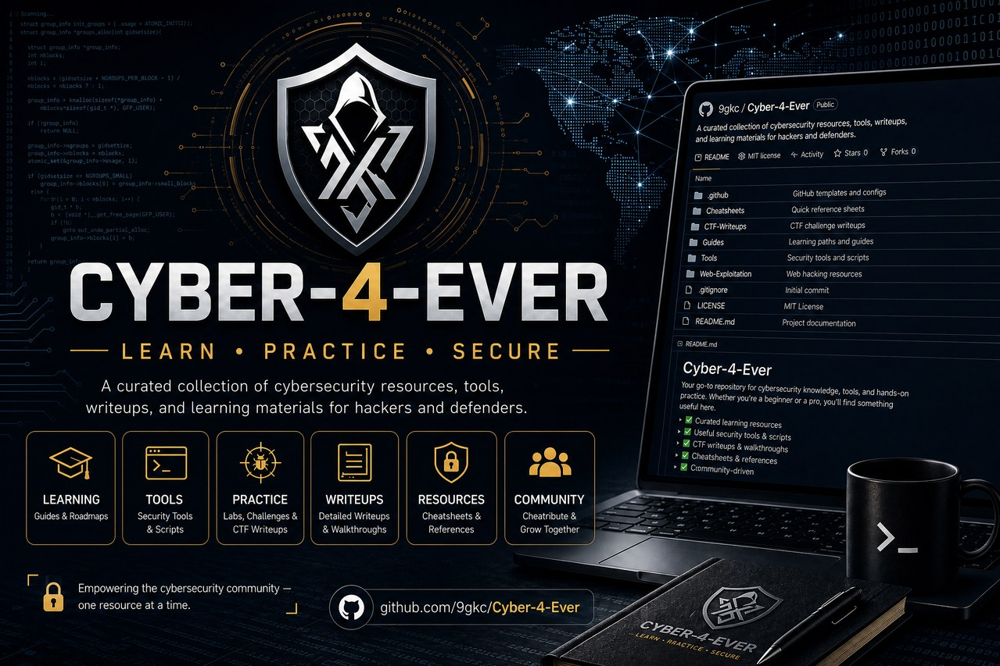

# Cyber 4 Ever



> A privacy-first cybersecurity learning workspace for students who want to learn in sequence, practice only in authorized environments, and build an honest record of their work.

[](https://github.com/9gkc/Cyber-4-Ever/actions/workflows/quality.yml)
[](https://github.com/9gkc/Cyber-4-Ever/actions/workflows/deploy-pages.yml)

## Live platform

**Open Cyber 4 Ever:** [https://9gkc.github.io/Cyber-4-Ever/](https://9gkc.github.io/Cyber-4-Ever/)

Cyber 4 Ever is not a scanner, does not collect targets, and does not simulate attacks against real systems. It brings together role-oriented learning paths, references to purpose-built training labs, a private study planner, a local lab journal, and an evidence-aware student portfolio.

## What students can do

| Area | Student capability | Safety boundary |
| :--- | :--- | :--- |
| **Learning roadmaps** | Follow four ordered paths: Web Application Security, SOC Operations, Digital Forensics, and Cloud Security. | Focused on concepts and defensive controls. |
| **Safe labs** | Visit official references for purpose-built environments such as OWASP Juice Shop and Web Security Academy. | No real targets and no in-app scanning. |
| **Study planner** | Create time-bounded daily sessions and record progress locally in the browser. | No accounts and no user analytics. |
| **Lab journal** | Keep structured notes with JSON export and import. | Persistent reminders not to store secrets or sensitive data. |
| **Student portfolio** | Present projects, certificates, and lab milestones with optional HTTPS evidence links. | No credentials are issued and identity is not verified automatically. |

## Design principles

**English-first.** The repository, interface, and documentation are written in clear professional English.

**Privacy-first.** There is no database, sign-in, or analytics SDK. Completion records, planned sessions, journal entries, and portfolio items are stored in the user’s own browser with `localStorage`. Users can export their data at any time or clear it through browser site data controls.

**Evidence, not claims.** The platform does not fabricate achievements, praise, or certificates. When a learner marks an item as evidence-linked, the interface requires a reviewable HTTPS URL. The reviewer remains responsible for evaluating that evidence.

**Authorized practice only.** The platform rule is simple: *if you do not have explicit, specific authorization, do not test.* Read the [Responsible Practice Policy](docs/responsible-practice.md) before using any lab reference.

## Run locally

The project requires Node.js 22+ and pnpm.

```bash
git clone https://github.com/9gkc/Cyber-4-Ever.git
cd Cyber-4-Ever
pnpm install --frozen-lockfile
pnpm dev
```

| Command | Purpose |
| :--- | :--- |
| `pnpm dev` | Start the local development environment. |
| `pnpm test` | Run Vitest checks for progress, storage, and URL-validation logic. |
| `pnpm lint` | Type-check TypeScript without emitting output. |
| `pnpm build` | Produce the static production build in `dist/`. |

## Quality and deployment

The Vitest suite covers learning-progress calculations, completed study-time aggregation, HTTPS-only portfolio evidence, and allowlisted training-resource URLs. GitHub Actions runs tests and the production build on every push and pull request. A successful default-branch build deploys the static application to GitHub Pages.

## Curriculum sources

The learning content is structured around NICE work roles and skills, with references to OWASP guidance and official training environments. See [the source record](docs/sources.md) for details and direct references.

## Contributing and security

Read [CONTRIBUTING.md](CONTRIBUTING.md) before contributing. Do not open a public issue containing potential security-vulnerability details; follow [SECURITY.md](SECURITY.md) for responsible reporting.

## License

This project is licensed under the [MIT License](LICENSE).
